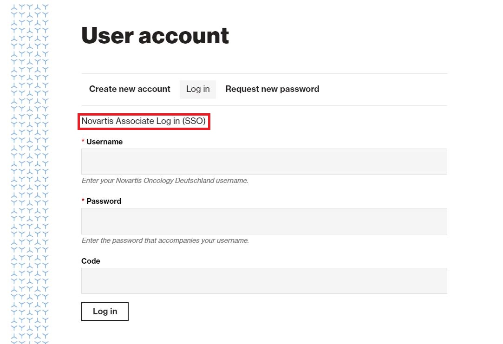

# Drupal

Novartis had migrated all of its outward facing web sites to Drupal, and will migrate most of its current DigiOne portfolio. 

The URL to log in to Drupal is always **http://SiteURL/user**. This page will look like screen shot to the right.

Simply type the username and password provided and click LOG IN. If you forget your password, click the Request new password button, and you will be send a link you can follow ONE TIME to log in and create a new password. 


Note: The site owner may implement Single Sign On \(SSO\), and provide access to a given Novartis email address. In this case, click on the “Novartis Associate Log in \(SSO\), and you will automatically be logged in. 


When you log in to Drupal, you will be authenticated against a role to which you have been assigned. You will then be shown only the GUI tools and admin toolbar that are relevant to those roles. 




By default, content contributors can contribute content as their name implies. 

Specifically, they can:

•	Add new content nodes
  
•	Edit existing nodes \(anyone’s, even those created by someone else\)
  
•	Delete existing nodes Note: this is permanent; there is no Drupal recycle bin!
  
•	Submit new nodes and node changes to Channel Manager for review




By default, this role can do everything a Content Contributor can do, plus:

•	Publish nodes submitted for review
  
•	Reject nodes submitted for review
  
•	Publish nodes marked as Approved by a Legal Approver
  
•	Submit nodes for Legal Review




Determining which nodes should be should be submitted for legal review is division and site specific. Not all sites will choose to have this role available. Consult your legal department for support. By default, this role can only do the following:

•	Edit nodes submitted for Legal Review. Note: The Legal Approver role can only edit existing nodes that have been submitted for Legal review. Legal Approvers cannot create new nodes
  
•	Reject nodes submitted for Legal review, which moves the node to the Rejected page for Channel Mangers to review
  
•	Approve nodes submitted for Legal review, which moves the node to the Approved page for Channel Mangers to publish







