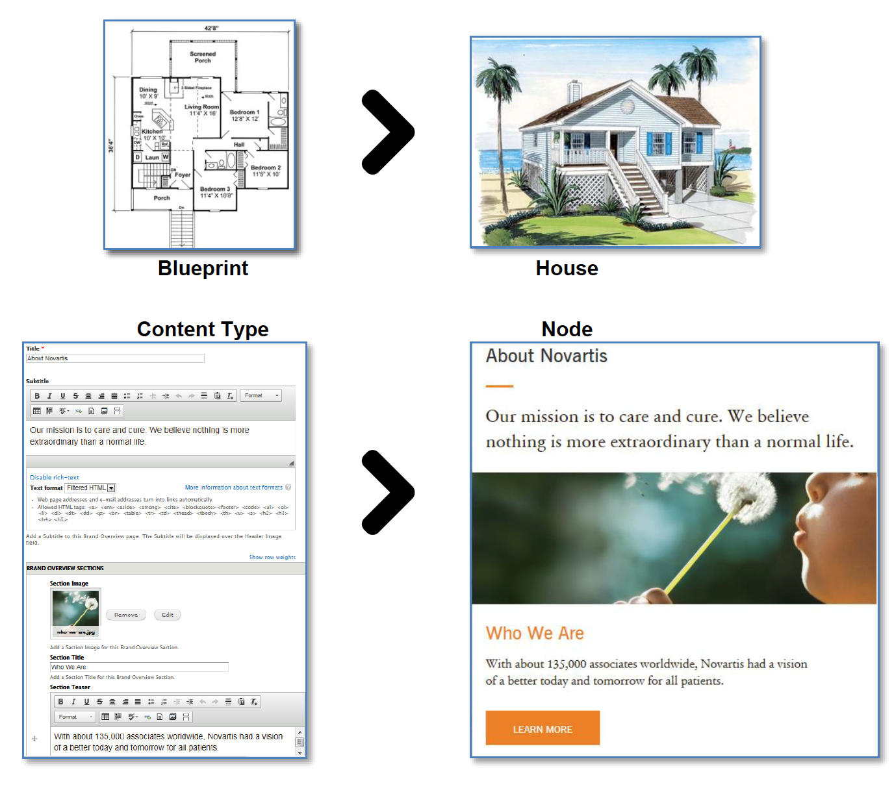

# Content types and Nodes

In Drupal, most content is added to a node, which is simply a container for content on a web page. Each web page is comprised of several nodes. See red rectangles below for examples.

Each Drupal node must be an instance of one of the pre-defined content types. A content type is a template for a new node, each with a specific purpose and a specific set of columns, and each column configured to handle a different piece of data. For instance, a new Author node would be an instance of the Author content type, with columns related to an author, like Name, Image, and Bio. A new Story node \(an instance of the Story content type\) would contain columns related to a story, like Title, Published Date, and Body.

Think of the content type as a blueprint and the node as a house built based on that blueprint.

Most Novartis corporate sites have the below content types:

**Interior pages** **–** they are pure content/information pages
  
**Media Releases –** they are news articles / communications to media. They are listed in a dedicated section on the homepage, and in the news archive.
  
**Stories –** they are long articles on specific themes. They are listed in a dedicated section on the homepage, and in the news archive.
  
**Blocks –** they host specific content, and can be placed on the page templates, or on a specific page
  
**Views –** in Drupal, views are content queries, displaying content based on given parameters. The most common examples are the news archive or the Related Links. What is displayed here are “results”, and that can’t be manually entered.
  
**Nodequeues –** literally queues of nodes, they allow to stack content together in a container. The most visible examples are the homepage carousel and the homepage quicklinks.

