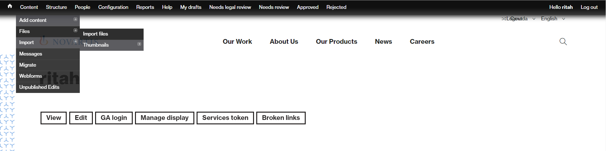

# Content Management

SEO best practices are taking an increasing importance, and Novartis runs frequent audits to verify they are followed. Below is a list of the most common things to know and look for. These should be created by a professional. Alternatively, they must follow common sense:

* All content name should be meaningful of what they represent. A PDF named “aad2017\_e.pdf” speaks less than “AAD\_Congress\_2017\_Report\_English.pdf”
* Image file names should end in “…\_image.Extension”. E.g. “homepage\_banner\_Novartis\_Canada\_image.jpg”. Videos follow the same logic, i.e. “AAD\_Congress\_2017\_video.mp4”
* Alt tags are a text alternative to images when a browser can't properly render them. Even when the image is rendered, if you hover over it with your mouse pointer, you can see the alt tag text created for that image \(depending on your browser settings\). The alt attribute also adds SEO value to your website. Adding appropriate alt tags to the images on your website can help your website achieve better rankings in the search engines by associating keywords with images.
* Images should be optimized for web viewing \(File &gt; Save for Web \(or Export in recent versions\) in Photoshop\) 
* Any page headline should be 25 characters long
* Link of the page should be the same as the headline

### 
Uploading / editing a file

1.  Hover over Content, and click on Files
2.  A list of all existing files appears. Use “Add file”, then drag and drop \(or browse\) the files you want to upload. Once all have been selected, click on “Start upload”. Once done, hit “Next”
3.  You are taken to the “edit” interface of your file. The name of your file is pre-filled. Fill in the metadata – Title should be the same as your file name. Alt text should be provided. Alternatively, it needs to describe accurately what the image is about. If you do not have them, please read the quick guide to SEO best practices
4.  Once all is filled, hit save. Once all assets have been uploaded and “SEO’ed”, you are taken back to the list of all files.

