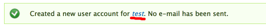

# User management

In the Administration bar, find the People menu – To see existing users, click on People. To directly add a user, click on the submenu item.

### 

### Adding an internal Novartis user

1. From the Admin toolbar, hover over People and choose Add user
2. Fill in the fields and click Create new account
   1.  In the case of a Novartis email address, single sign-on is enabled. This means that only the user name and email address are relevant – the password will be ignored, as it will use the associate’s Windows password to authenticate the user
3. You will then be show confirmation that the account was created; you will then be shown a new blank form to create another new user

### Adding an external user

1. Install Google Authenticator \(“GA”, extension on Google Chrome\)
2. From the Admin toolbar, hover over People and choose Add user
3. Fill in the fields and click Create new account
4. You will then be show confirmation that the account was created in a green ribbon – you will need to click on the newly created username:

5. On the next screen, you will need to set up the Google Authenticator code – Note: if this step is wrongly done, you will need to remove and recreate the user  
6. Click on GA login, then Get Started  
7. Select “Time-based” as a code type, and create the code  
8. On the next screen, a key is generated. Keep a record of it, it will need to be communicated to the future user  

9.	Open GA, click on the pen, the + sign, and click “Manual Entry”
  
10.	Add the new code and a relevant name to recognize it
  
11.	Once added, copy the time-based code, and enter it in the “\* Code” field \(see screenshot above\), and hit “Use this code” 
  
12.	The page will then load, and a green banner “You can now log in with your new code” will display
  
13.	You may now communicate the username, email address and key to the user. They will need to set up GA on their machine as well, as the code will be asked at every login 

