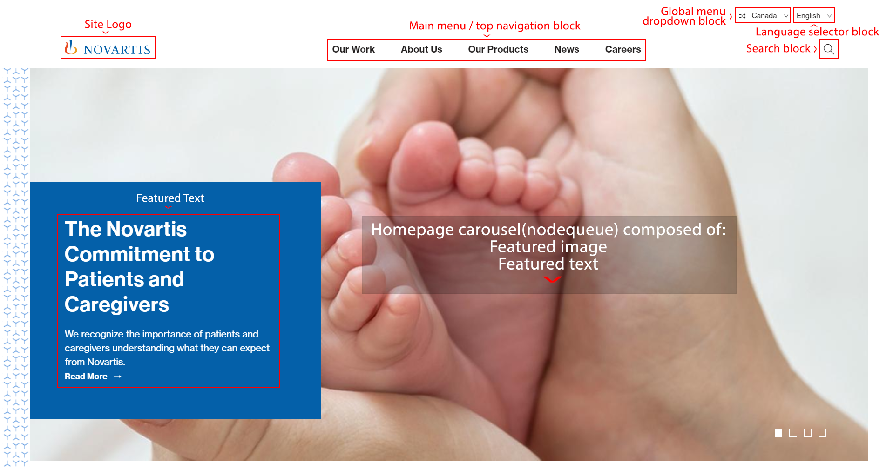
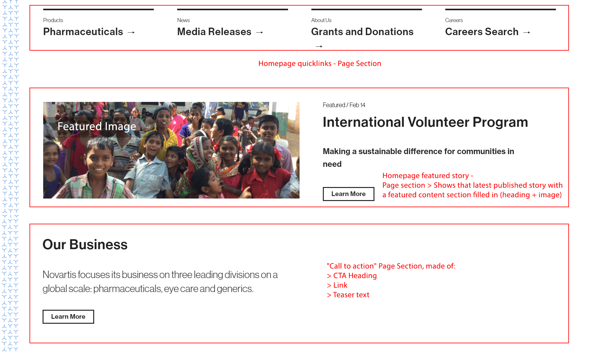
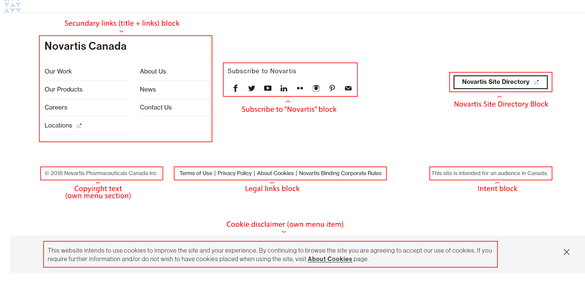
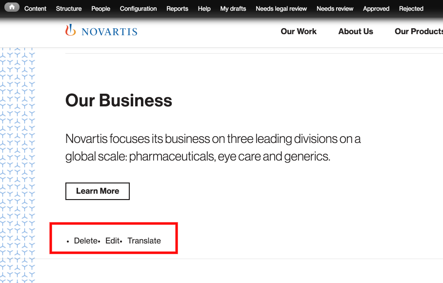
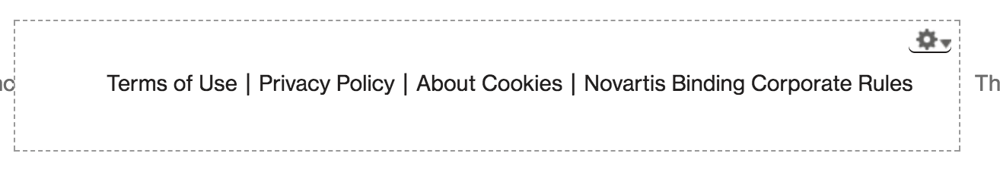

# Homepage Structure

### Updating the homepage

Blocks will display a dashed border and a parameter wheel on hover. This can be seen as the “quick link” to editing a specific node / block.

When connected as an admin, each node on the homepage will show delete or edit options, and translate if the site is multilingual. 

Blocks will display a dashed border and a parameter wheel on hover. This can be seen as the “quick link” to editing a specific node / block.

In this guide, we will detail where each option can be found. 

